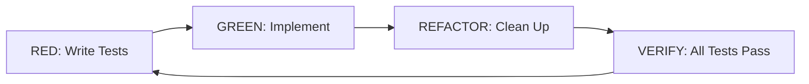

<!--
This template captures the structure that made GSP-040/041/042 (this repo's
observability, compliance-test, and Docker tickets) the standard of quality
for issues here: nothing left to invent, real code instead of prose
descriptions of code, and explicit dependency/troubleshooting information.

SCOPE THE DEPTH TO THE COMPLEXITY. This is not a fill-in-every-section form —
using the full template on a small task is as much a mistake as skipping
sections on a big one. Rough guide:

  - New capability, non-trivial feature, or anything where "what does done
    look like" isn't obvious from the title → full template: TDD workflow
    diagram, code-complete implementation plan, test files with real
    assertions, troubleshooting table.
  - Investigation / research task (answer a question, decide between
    options) → Description, Context, a plain checklist of what to
    investigate, and a decision record at the end. No TDD workflow, no code
    — there's no code to write yet.
  - Review / audit task (security review, docs pass, verify existing
    behavior) → Description, Context, a concrete checklist of specific
    things to check (name them — "verify constant-time comparison on X," not
    "review for issues"). Skip the TDD/test-file sections unless the review
    itself produces new tests.
  - Straightforward fix or config change with an obvious definition of done
    → Description and Acceptance Criteria are enough. Everything else is
    noise that makes the real signal (what changed, why) harder to find.

When in doubt, undersize rather than oversize — a thin ticket that's easy to
read beats a full-template ticket where most sections say "N/A."

Delete this comment block and any unused sections before submitting.
-->

# TICKET-ID: <Title>

**Labels:** `<label>` `<label>` `<label>`
**Milestone:** <milestone name, if any>
**Dependencies:** <other ticket IDs this depends on, or "None">

---

## Description

<One or two sentences: what this ticket delivers and why.>

---

## Context

<Links to the specific requirements/design/decision docs this ticket traces
back to. If there's no such doc in this repo, say so rather than omitting
the section.>

- `<path/to/requirements-or-design-doc.md>` §<section>

---

## TDD Workflow



### Phase Details

| Phase | Action | Verification |
|-------|--------|--------------|
| **RED** | Write tests that define the expected behavior | Tests fail for the right reason (feature doesn't exist yet) |
| **GREEN** | Implement the minimum to pass | Tests pass |
| **REFACTOR** | Clean up without changing behavior | Tests still pass |
| **VERIFY** | Full suite + coverage check | 100% of this ticket's tests pass |

---

## Test Requirements

### Test File: `<path/to/test.spec.ts>`

```typescript
// <path/to/test.spec.ts>
// PURPOSE: <what this file verifies>
// TEST MATRIX: <test-id(s) this covers, if this repo tracks one>

// Real test code here — assertions that would actually fail against a
// wrong or incomplete implementation, not `expect(true).toBe(true)`
// placeholders and not substring/regex checks where a stronger assertion
// (exact equality, structural comparison, isomorphism, etc.) is available.
```

<Repeat for each test file this ticket needs — unit and integration
separately if this repo distinguishes them.>

---

## Test Matrix Coverage

| Test ID | Coverage | Location |
|---------|----------|----------|
| <ID> | <what it proves> | `<test file path>` |

---

## Reference Documents

<Same list as Context, or expanded if there are additional docs worth
pointing implementers at — style guides, prior decision records, etc.>

---

## Implementation Plan

Step-by-step, in the order a fresh implementer (human or agent) should
actually execute them. Include real commands and real file contents where
the ticket already knows what they should be — don't make the implementer
re-derive something this ticket could just state.

### Step 1: <First concrete action>

```bash
<actual command, if any>
```

### Step 2: <Next action>

<Create/modify file `<path>`:>

```typescript
// actual code, not a description of code
```

<Continue numbering through however many steps this actually takes.>

### Step N: Run tests, verify

```bash
<actual test command for this repo>
```

---

## Test Execution Order

1. **<Test group 1>** — <what it checks>
2. **<Test group 2>** — <what it checks>

---

## Troubleshooting

| Issue | Solution |
|-------|----------|
| <a specific way this could fail> | <how to diagnose/fix it> |

---

## Acceptance Criteria

- [ ] <Specific, checkable condition — ties back to a Test Matrix ID where possible>
- [ ] <Another>

---

## Branch

```bash
git checkout -b feature/TICKET-ID-<short-slug>
```
