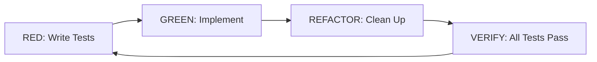

# Contributing

Thanks for taking a look at this project. It's a small, single-maintainer
repository (see [SECURITY.md](./SECURITY.md)), but it's built to a
process — extreme TDD, everything traced back to a requirements/design
document, and a CI gate that enforces both — and that process applies the
same way to any contribution, including the maintainer's own.

## Before you start

Read [README.md](./README.md) first — it covers what the server does, its
current HTTP surface, and what's not implemented yet. If you're new to RDF,
SPARQL, or the Graph Store Protocol, its "Background" section is written for
exactly that.

For anything beyond a small fix, skim
[`aidlc-docs/inception/`](./aidlc-docs/inception/) too:

- `requirements/SPARQL12-GSP-URD.md` — the User Requirement Document this
  server is built against (functional/non-functional requirements, the W3C
  conformance baseline it targets, open questions).
- `requirements/SPARQL12-GSP-TESTS.md` — the requirements-level test matrix.
- `application-design/` — the architecture, component breakdown, and unit-
  of-work decomposition the codebase follows.
- `risk-analysis.md` — the known risks (blank node handling, PATCH lost
  updates, ETag correctness, etc.) and how each was mitigated.

These aren't archived planning docs — they're the normative source for *why*
the code looks the way it does. If a change contradicts one of them, either
the doc needs updating first or the change needs rethinking.

## Development setup

```bash
git clone https://github.com/propersloth/sparql12-gsp-server.git
cd sparql12-gsp-server
npm ci
cp .env.example .env   # set GSP_DATABASE_URL and GSP_AUTH_JWT_SECRET at minimum
npm run start:dev      # http://localhost:3000
```

You'll want a local PostgreSQL instance for the DB-backed suites (see
Testing below); anything recent works, CI runs against `postgres:16-alpine`.

## Workflow

Fork the repo (or, if you have push access, branch directly) and work off
`main`. **`main` is protected by a repository ruleset that requires every
change to land through a pull request with passing status checks — there is
no bypass, including for the maintainer.** There is no direct-push path for
routine changes.

Name branches after the issue they close, matching what's already in this
repo's history:

```
feature/issue-<N>-<short-slug>
```

(Tickets that predate GitHub issue numbering used `feature/GSP-<NNN>-<slug>`
— either pattern is fine as long as it's traceable to the work item.)

### Picking up work

Issues in this repo use the **"Vetted implementation ticket"** template
(`.github/ISSUE_TEMPLATE/vetted-implementation-ticket.md`). The template is
explicit that its depth should match the task, not the other way around:

- **New capability / non-trivial feature** — full template: TDD workflow,
  a code-complete implementation plan, real test files with real
  assertions, a troubleshooting table. Nothing left for the implementer to
  invent.
- **Investigation or research task** — Description, Context, a checklist of
  what to investigate, and a decision record. No TDD workflow — there's no
  code to write yet.
- **Review or audit task** (security review, docs pass, behavior
  verification) — Description, Context, and a *concrete* checklist ("verify
  constant-time comparison on X," not "review for issues"). Skip the
  TDD/test-file sections unless the review itself produces new tests.
- **Straightforward fix or config change** — Description and Acceptance
  Criteria are enough.

If you're opening a new ticket, use that template and size it the same way.
If you're picking up an existing one, it should already tell you which of
the above applies.

## TDD workflow

This project practices RED → GREEN → REFACTOR → VERIFY for anything that
isn't a pure docs/config change:



| Phase | What happens | How you know it worked |
| --- | --- | --- |
| **RED** | Write the test(s) that define the expected behavior, against the interface you want, before the implementation exists. | The test fails for the *right* reason — missing behavior, not a typo. |
| **GREEN** | Write the minimum implementation to make it pass. | The test (and the rest of the suite) passes. |
| **REFACTOR** | Clean up the implementation and/or test without changing observable behavior. | Suite still passes, unchanged. |
| **VERIFY** | Run the full suite relevant to your change. | Everything passes — not just your new test. |

In practice: unit tests live under `tests/unit/`, integration tests under
`tests/integration/`, mirroring `src/`'s module layout. Look at a
neighboring `*.spec.ts` file for the pattern before writing a new one —
this codebase favors real assertions (exact equality, structural
comparison, isomorphism checks for RDF graphs) over loose substring/regex
matching or `expect(true).toBe(true)` placeholders.

## Running tests

```bash
npm test              # full suite, DB-backed suites excluded (see below)
npm run test:cov       # same, with coverage
npm run test:schema    # DB-backed schema/migration suite only
npm run test:compliance  # DB-backed G1-G9 URD compliance suite only
```

`npm test` intentionally excludes `tests/unit/database/schema.spec.ts` and
`tests/integration/compliance.spec.ts` — both need a reachable PostgreSQL
instance, which the default run doesn't assume. To run them:

```bash
TEST_DATABASE_URL=postgresql://<user>:<password>@localhost:5432/gsp_test npm run test:schema
TEST_DATABASE_URL=postgresql://<user>:<password>@localhost:5432/gsp_test npm run test:compliance
```

There's no separate lint step — `tsconfig.json` runs in `strict` mode, and
`npm run build` (which CI also runs) is the type-checking gate. Code that
doesn't compile clean under strict mode won't pass CI.

## Commits and pull requests

- Keep commits scoped and describe the *why*, not just the *what* — look at
  `git log` for this repo's tone (e.g. `GSP-040: implement Pino structured
  logging and OpenTelemetry tracing`, `fix: disable auth enforcement for
  the compliance suite`, `docs: resolve OQ-05 isolation-level residual`).
- Reference the issue/ticket the change closes.
- Push your branch and open a PR with `Closes #<N>` in the description.
- CI runs four required status checks on every PR into `main`:
  **actionlint** (workflow-file validation), **test** (the default Jest
  suite), **schema-test** (DB-backed schema suite, against a real Postgres
  service container), and **compliance-test** (the full G1-G9 URD
  compliance suite, same service container). All four must pass — the
  branch ruleset has no bypass actors, so there's no way to merge around a
  failing check.
- Leave the PR for review rather than merging it yourself, even if you
  technically have permission to push to `main` directly — the whole point
  of the ruleset is that nothing lands without going through this path.

## Versioning

Don't hand-edit `package.json`'s `version` field. A `bump-patch` GitHub
Action bumps the patch version automatically on every merge to `main`
(itself going through the same PR + required-checks path as everything
else). This project is deliberately pre-1.0.0 and untagged — no Git tags,
no GitHub Releases, no npm publish, no CHANGELOG — version numbers here are
just a lightweight counter, not a release process.

## Security

Do not open a public issue for a security vulnerability. See
[SECURITY.md](./SECURITY.md) for how to report one.
