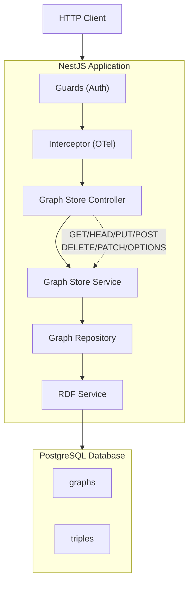

# Application Design Document

#normative #inception #design

## SPARQL 1.2 Graph Store Protocol Server

| Field                | Value                                                                                                                               |
| -------------------- | ----------------------------------------------------------------------------------------------------------------------------------- |
| **Document type**    | AIDLC Application Design — Inception Phase                                                                                          |
| **Status**           | Amended                                                                                                                             |
| **Technology Stack** | NestJS + TypeScript + PostgreSQL                                                                                                    |
| **RDF Library**      | Multi-library: N3.js (Turtle/TriG/N-Triples/N-Quads) + rdfxml-streaming-parser (RDF/XML) + jsonld/jsonld-streaming-parser (JSON-LD) |

> **Amendment log.** Six bugs corrected against URD conformance review and pre-construction analysis. Changes are: (1) schema `iri NOT NULL` contradiction resolved via sentinel IRI; (2) trigger removed — version incremented by mutation transaction; (3) PATCH check order corrected per OQ-14; (4) dataset reconciliation corrected per UR-FMT-04; (5) advisory lock mechanism corrected to use transaction connection; (6) ETag comparison split into read/write variants per UR-CC-03. See `GSP-ApplicationDesign-Review.md` for full detail.

---

## 1. Architecture Overview

### 1.1 High-Level Architecture



### 1.2 Design Principles

| Principle | Implementation |
|-----------|----------------|
| **Streaming** | Node.js streams with backpressure for large payloads |
| **Injectable RDF Service** | Multi-library routing per media type |
| **Pluggable Auth** | Guard-based auth with configurable JWT/API Key |
| **Observability** | Pino JSON logs + OpenTelemetry SDK |
| **Concurrency** | Transaction-scoped advisory locks + revision counter |

---

## 2. Database Schema

### 2.1 Normalized Triple Store

**Justification:** Future SPARQL Query endpoint planned. Normalized storage enables native SQL queries on triple patterns.

> **Amendment D-01/D-02/D-07:** The original schema had a logical contradiction (`iri NOT NULL` and a CHECK requiring `iri IS NULL` for the default graph) and a trigger with a DELETE bug (`NEW.graph_id` is NULL on row-level DELETE triggers). Both are corrected below. The default graph uses a reserved sentinel IRI; version is incremented by the mutation transaction, not a trigger; blank-node subjects are stored with an explicit discriminator instead of being forced into Skolem IRIs.

```sql
CREATE EXTENSION IF NOT EXISTS pgcrypto;

-- Main graphs table
CREATE TABLE graphs (
  id         UUID PRIMARY KEY DEFAULT gen_random_uuid(),
  iri        TEXT NOT NULL UNIQUE,         -- sentinel 'urn:x-arq:DefaultGraph' for default graph
  version    BIGINT NOT NULL DEFAULT 0,   -- monotonic per-graph revision counter (BIGINT, not INT)
  is_default BOOLEAN NOT NULL DEFAULT false,
  created_at TIMESTAMPTZ NOT NULL DEFAULT now(),
  updated_at TIMESTAMPTZ NOT NULL DEFAULT now()
);

-- Enforce exactly one default-graph row (partial unique index)
CREATE UNIQUE INDEX uq_graphs_single_default ON graphs (is_default) WHERE is_default;

-- Seed the single default-graph row; sentinel IRI never exposed to clients
INSERT INTO graphs (iri, is_default, version)
VALUES ('urn:x-arq:DefaultGraph', true, 0);

-- Normalized triples table
CREATE TABLE triples (
  id          BIGSERIAL PRIMARY KEY,
  graph_id    UUID NOT NULL REFERENCES graphs(id) ON DELETE CASCADE,
  subject     TEXT NOT NULL,
  subject_type CHAR(1) NOT NULL DEFAULT 'U' CHECK (subject_type IN ('U', 'B')),
  predicate   TEXT NOT NULL,
  object      TEXT NOT NULL,
  object_type CHAR(1) NOT NULL CHECK (object_type IN ('U', 'L', 'B')),
  lang_tag    TEXT,
  datatype    TEXT,
  created_at  TIMESTAMPTZ NOT NULL DEFAULT now()
);

-- Indexes for SPARQL-optimized queries
CREATE INDEX idx_triples_graph_id        ON triples(graph_id);
CREATE INDEX idx_triples_subject         ON triples(subject);
CREATE INDEX idx_triples_predicate       ON triples(predicate);
CREATE INDEX idx_triples_object          ON triples(object);
CREATE INDEX idx_triples_graph_subject   ON triples(graph_id, subject);
CREATE INDEX idx_triples_graph_predicate ON triples(graph_id, predicate);
CREATE INDEX idx_triples_graph_object    ON triples(graph_id, object);

-- DB-level deduplication guard: prevents duplicate triples from implementation bugs or retries.
-- Application code uses mergeNormalized() for merge logic, but this index is the safety net.
CREATE UNIQUE INDEX idx_triples_unique ON triples(
  graph_id, subject, subject_type, predicate, object, object_type,
  COALESCE(lang_tag, ''), COALESCE(datatype, '')
);
-- TripleRepository.insert() MUST use INSERT ... ON CONFLICT DO NOTHING when this index is present.

-- NO VERSION TRIGGER. The mutation transaction owns version increments (Amendment D-02):
--   UPDATE graphs SET version = version + 1, updated_at = now() WHERE id = $1
-- This guarantees exactly one +1 per committed logical mutation and avoids the
-- NEW.graph_id = NULL bug on DELETE row-level triggers.
```

### 2.2 Version Counter Design

Version is a `BIGINT` monotonic counter embedded in the `graphs` table. **It is incremented by the application code inside the same transaction as the mutation** — not by a database trigger. This guarantees:
- Exactly one increment per committed logical mutation (not per row affected).
- The increment and the triple writes commit or roll back atomically.
- No `NEW` / `OLD` trigger bugs on DELETE operations.

```typescript
// Inside every mutation transaction (PUT/POST/DELETE/PATCH):
const [row] = await manager.query(
  'UPDATE graphs SET version = version + 1, updated_at = now() WHERE id = $1 RETURNING version',
  [graphId],
);
return Number(row.version);
```

---

## 3. Component Design

### 3.1 Controllers

| Controller | Responsibility |
|------------|----------------|
| `GraphStoreController` | HTTP endpoint routing for all GSP methods |
| `CapabilityController` | OPTIONS response handling |

### 3.2 Services

| Service                     | Responsibility                                              |
| --------------------------- | ----------------------------------------------------------- |
| `GraphStoreService`         | Core business logic, HTTP semantics, ETag generation        |
| `GraphRoutingService`       | Direct/indirect graph identification                        |
| `ContentNegotiationService` | Accept/Content-Type handling                                |
| `ConcurrencyService`        | Transaction-scoped advisory lock, version comparison        |
| `RdfService`                | RDF parse/serialize/merge/patch operations (multi-library)  |
| `PatchService`              | SPARQL Update thin wrapper over RdfService (see note below) |
| `AuthService`               | JWT/API Key validation                                      |
| `LoggingService`            | Structured logging with OTel correlation                    |

> **PatchService (Amendment S-01):** `PatchService` is a thin DI wrapper whose `validate`, `parse`, `scopeToGraph`, and `apply` methods delegate to `RdfService`. It exists to preserve the module registration and keep PATCH concerns addressable via a named service. Construction teams must implement the class; do not leave it unresolved in the module providers list.

### 3.3 Repositories

| Repository | Responsibility |
|------------|----------------|
| `GraphRepository` | Graph CRUD, transaction-aware version increment |
| `TripleRepository` | Triple CRUD, bulk operations, streaming |

### 3.4 Guards

|Guard|Responsibility|
|---|---|
|`JwtAuthGuard`|Bearer token validation|
|`ApiKeyGuard`|API Key header validation|
|`OptionalAuthGuard`|Allows unauthenticated reads|

### 3.5 Interceptors/Decorators

| Component            | Purpose                             |
| -------------------- | ----------------------------------- |
| `TracingInterceptor` | OpenTelemetry span creation         |
| `LoggingInterceptor` | Request/response structured logging |
| `ETagInterceptor`    | ETag injection on responses         |

---

## 4. API Design

### 4.1 Endpoint Overview

| Method  | Path Pattern               | Description                                   |
| ------- | -------------------------- | --------------------------------------------- |
| GET     | `/graph/:graphIri`         | Direct: retrieve named graph                  |
| GET     | `/graph-store?graph={iri}` | Indirect: retrieve by query param             |
| GET     | `/graph-store?default`     | Indirect: retrieve default graph              |
| HEAD    | `/graph/:graphIri`         | Same as GET, no body                          |
| HEAD    | `/graph-store?graph={iri}` | Same as GET, no body                          |
| PUT     | `/graph/:graphIri`         | Replace graph content                         |
| PUT     | `/graph-store?graph={iri}` | Replace via indirect                          |
| POST    | `/graph/:graphIri`         | Merge into **existing** graph (404 if absent) |
| POST    | `/graph-store`             | Mint new graph, return Location               |
| DELETE  | `/graph/:graphIri`         | Delete named graph                            |
| DELETE  | `/graph-store?graph={iri}` | Delete via indirect                           |
| PATCH   | `/graph/:graphIri`         | Incremental update (SPARQL Update)            |
| PATCH   | `/graph-store?graph={iri}` | PATCH via indirect                            |
| OPTIONS | `/*`                       | Capability discovery                          |

> [!NOTE]
> **Route pattern note:** `:graphIri` is a `:param` style parameter. Clients MUST percent-encode the IRI (CON-04). Express does not auto-decode `%2F` in named params, so encoded slashes are safe.

### 4.2 Response Headers

| Header             | Description                                             | Requirement                   |
| ------------------ | ------------------------------------------------------- | ----------------------------- |
| `ETag`             | Strong validator `"{graphId}.{rev}.{encodedMediaType}"` | MUST (GET/HEAD)               |
| `Content-Type`     | Negotiated RDF media type                               | MUST                          |
| `Allow`            | Supported methods                                       | MUST (405)                    |
| `Accept-Patch`     | Supported patch types                                   | MUST (OPTIONS + 415 to PATCH) |
| `Location`         | Minted graph URI on POST-to-store                       | MUST (201)                    |
| `Vary`             | `Accept` for content negotiation                        | MUST (all GET/HEAD)           |
| `WWW-Authenticate` | Auth scheme challenge                                   | MUST (401)                    |
| `Last-Modified`    | May supply in addition to ETag                          | SHOULD                        |

### 4.3 Status Codes

| Code | Condition | Requirement |
|------|-----------|-------------|
| 200 | GET/DELETE success | MUST |
| 201 | Graph created (PUT new, POST mint) | MUST |
| 204 | Success, no body (PUT existing, POST empty, zero-triple PUT) | MUST |
| 304 | Conditional GET: ETag matched (full ETag incl. format) | HTTP |
| 400 | Parse failure, non-absolute IRI, dataset mismatch | MUST |
| 401 | Authentication required | MUST |
| 403 | Authorization refused, creation refused | MUST |
| 404 | Graph not found | MUST |
| 405 | Method not allowed (with `Allow` header) | MUST |
| 406 | Accept not satisfiable | SHOULD |
| 409 | PATCH state conflict | SHOULD (PATCH) |
| 412 | Precondition failed | MUST (conditional) |
| 415 | Unsupported media type (with `Accept-Patch` on PATCH) | MUST |
| 422 | PATCH scope violation | MUST (PATCH) |
| 428 | PATCH missing `If-Match` | MUST (PATCH) |

---

## 5. ETag Design

### 5.1 Format

```
"{graphId}.{revision}.{encodedMediaType}"
```

- `graphId` — UUID from the `graphs` table (opaque to clients).
- `revision` — the `BIGINT` version counter; a non-negative integer.
- `encodedMediaType` — `encodeURIComponent(mediaType)` so `/` and `+` are escaped.

Example: `"a1b2c3d4.42.text%2Fturtle"`

> **Amendment D-06:** The original example `"a1b2c3d4.42.turtle"` used an unencoded short label. The canonical form uses the URL-encoded full media type so the three-component dot-split is unambiguous for any registered media type (including `application/ld+json`).

### 5.2 Comparison Semantics (UR-CC-03)

One graph state has multiple serializations. The two operations require different comparison semantics:

| Operation | Header | Comparison | Method |
|-----------|--------|------------|--------|
| Conditional GET/HEAD | `If-None-Match` | Full ETag (graphId + rev + format) | `compareStrong()` |
| Conditional PATCH `If-Match` | `If-Match` | State only (graphId + rev) | `compareState()` |
| Conditional PUT/DELETE `If-Match` | `If-Match` | State only (graphId + rev) | `compareState()` |

`compareStrong` prevents a Turtle-cached client from receiving a spurious 304 when requesting JSON-LD at the same revision.

`compareState` allows a client that read the graph as Turtle to precondition a PATCH regardless of the format it used to read.

### 5.3 Vary Header

```
Vary: Accept
```

All negotiated GET/HEAD responses MUST include `Vary: Accept` (set by `ETagInterceptor`).

---

## 6. Concurrency Control

### 6.1 Advisory Lock Pattern

> **Amendment D-05:** The original used `this.pgPool.query(...)` on a raw pool connection, which is a different connection from the TypeORM transaction. A transaction-scoped advisory lock must be acquired on the **same connection** as the transaction. The corrected API accepts an `EntityManager` from the caller's open transaction.

```typescript
// ConcurrencyService.lock — call inside an open dataSource.transaction() lambda
async lock(manager: EntityManager, iri: string): Promise<void> {
  await manager.query(
    'SELECT pg_advisory_xact_lock($1)',
    [this.hashGraphId(iri)]
  );
  // Lock is released automatically when the surrounding transaction commits/rolls back.
}
```

### 6.2 Atomic Compare-and-Swap

Every mutation follows this sequence, entirely within one transaction:

```typescript
await this.dataSource.transaction(async (manager) => {
  // 1. Acquire advisory lock on this IRI for the transaction duration
  await this.concurrencyService.lock(manager, iri);

  // 2. Read current state (inside the locked transaction)
  const graph = await this.graphRepo.findByIriInTxn(manager, iri);
  if (!graph) throw new NotFoundException();

  // 3. Verify precondition (if supplied)
  if (ifMatch && !this.etagService.compareState(ifMatch, graph.id, graph.version)) {
    throw new PreconditionFailedException();
  }

  // 4. Apply mutation (delete old triples + insert new)
  await this.tripleRepo.deleteByGraphIdInTxn(manager, graph.id);
  await this.tripleRepo.insertInTxn(manager, graph.id, newTriples);

  // 5. Increment version inside the same transaction
  const [row] = await manager.query(
    'UPDATE graphs SET version = version + 1, updated_at = now() WHERE id = $1 RETURNING version',
    [graph.id]
  );
  return Number(row.version);
});
```

---

## 7. RDF Processing

### 7.1 Supported Formats

| Format | Media Type | Parse | Serialize | Library |
|--------|------------|-------|-----------|---------|
| RDF/XML | application/rdf+xml | ✓ | ✓ | rdfxml-streaming-parser / in-house `RdfXmlSerializer` |
| Turtle | text/turtle | ✓ | ✓ | N3.js |
| N-Triples | application/n-triples | ✓ | ✓ | N3.js |
| JSON-LD | application/ld+json | ✓ | ✓ | jsonld-streaming-parser / jsonld |
| TriG | application/trig | ✓ | ✓ | N3.js |
| N-Quads | application/n-quads | ✓ | ✓ | N3.js |

> **Decision (GSP-004 / GSP-005):** Branch B is adopted. The npm package `@rdfjs/serializer-rdfxml` is not published, so RDF/XML serialization is implemented by the in-house `RdfXmlSerializer` (`src/rdf/serializers/rdfxml.serializer.ts`). Per the GSP-004 spike outcome recorded by GSP-005, unsupported RDF/XML cases (for example an unsplittable predicate QName or an XML-1.0-illegal literal character) must raise `RdfXmlSerializationException` and map to **500**, never silently drop triples or emit malformed XML.

### 7.2 RDF Merge Implementation

Blank nodes are standardized apart on ingest. `parseWithReconciliation` uses one shared blank-node map per parse call, so the same blank node keeps the same `genid-{uuid}` label even if it appears once as a subject and once as an object. By the time `mergeNormalized` is called, blank-node subjects and objects have already been rewritten to those `genid-{uuid}` labels (without any `_:` prefix) plus their `subjectType` / `objectType` discriminators. `triplesToDataset` reconstructs both positions with `DataFactory.blankNode(label)`, so round-tripped datasets preserve `termType === 'BlankNode'`.

```typescript
// On ingest (parseWithReconciliation):
// Blank-node objects → stored as 'genid-{uuid}' label, objectType 'B'
// Blank-node subjects → stored as 'genid-{uuid}' label, subjectType 'B'

// On merge (mergeNormalized):
mergeNormalized(existing: NormalizedTriple[], incoming: NormalizedTriple[]): NormalizedTriple[] {
  const key = (t) => `${t.subject}\x00${t.subjectType}\x00${t.predicate}\x00${t.object}\x00${t.objectType}...`;
  const seen = new Set(existing.map(key));
  const result = [...existing];
  for (const t of incoming) if (!seen.has(key(t))) result.push(t);
  return result;
}
```

### 7.3 Dataset Reconciliation (UR-FMT-04)

> **Amendment D-04:** The original implementation threw `DatasetMismatchException` when a payload's default-graph triples were submitted to a named-graph target. This is wrong. Per UR-FMT-04, default-graph triples from the payload MUST be mapped to the target (named or default). Only triples in a **foreign named graph** (a named graph whose IRI differs from the target) are rejected.

```typescript
async parseWithReconciliation(
  payload: Buffer,
  contentType: string,
  targetGraphIri: string | null   // null = default graph
): Promise<NormalizedTriple[]> {
  const dataset = await this.rdfService.parse(payload, contentType);
  const rows: NormalizedTriple[] = [];

  for (const quad of dataset) {
    const isDefaultGraphTerm = quad.graph.termType === 'DefaultGraph';

    if (isDefaultGraphTerm) {
      // Default-graph triples ALWAYS map to the target (named or default).
      // They are never rejected (Amendment D-04 — corrects original which threw here).
    } else if (targetGraphIri !== null && quad.graph.value === targetGraphIri) {
      // Named graph that exactly equals the target — allowed.
    } else {
      // Foreign named graph, or any named graph when target is the default graph — reject.
      throw new DatasetMismatchException(
        `Payload contains graph <${quad.graph.value}> which does not match target <${targetGraphIri ?? '(default)'}>`
      );
    }

    rows.push(this.toRow(this.skolemizeIfBlank(quad)));
  }

  return rows;
}
```

---

## 8. Authentication & Authorization

### 8.1 Pluggable Auth Architecture

```typescript
interface AuthStrategy {
  authenticate(request: Request): Promise<AuthResult>;
}

class AuthGuard implements CanActivate {
  constructor(
    private strategies: AuthStrategy[],
    private policy: AccessPolicy
  ) {}

  async canActivate(context: ExecutionContext): Promise<boolean> {
    for (const strategy of this.strategies) {
      const result = await strategy.authenticate(context.switchToHttp().getRequest());
      if (result.authenticated) {
        return this.policy.authorize(result.identity, context);
      }
    }
    throw new UnauthorizedException();
  }
}
```

### 8.2 Supported Schemes

|Scheme|Header|Configuration|
|---|---|---|
|JWT Bearer|Authorization: Bearer|`JWT_SECRET`, `JWT_ALGORITHM`|
|API Key|X-API-Key:|`API_KEYS`(comma-separated or file)|

### 8.3 Access Policy Configuration

```yaml
access:
  policies:
    - resource: "system:*"
      deny: ["write"]
    - resource: "graph:http://example.org/internal/*"
      roles: ["admin"]
```

---

## 9. Observability

### 9.1 Structured Logging (Pino)

```typescript
// Request logging
logger.info({
  method: 'PUT',
  path: '/graph/http%3A%2F%2Fex.org%2Fg',
  graphIri: 'http://ex.org/g',
  contentType: 'text/turtle',
  outcome: 201,
  duration_ms: 45
}, 'Graph replaced');

// Error logging
logger.error({
  method: 'PATCH',
  graphIri: 'http://ex.org/g',
  error: 'DatasetMismatchException',
  details: 'Payload contains graph <http://other.org/g>'
}, 'PATCH failed');
```

### 9.2 OpenTelemetry Integration

```typescript
// Auto-instrumentation
import { NodeSDK } from '@opentelemetry/sdk-node';

const sdk = new NodeSDK({
  instrumentations: [getNodeAutoInstrumentations()],
  traceExporter: new OTLPTraceExporter(),
  metricExporter: new OTLPMetricExporter(),
});

// Manual span creation
const span = tracer.startSpan('graph.patch');
span.setAttributes({
  'gsp.graph.id': graphId,
  'gsp.patch.size_bytes': patch.length,
});
```

---

## 10. Configuration

### 10.1 Environment Variables

| Variable               | Default               | Description                                                |
| ---------------------- | --------------------- | ---------------------------------------------------------- |
| `GSP_DATABASE_URL`     | —                     | PostgreSQL connection string                               |
| `GSP_BASE_URL`         | http://localhost:3000 | Base URL for minted graph URIs                             |
| `GSP_AUTH_ENABLED`     | true                  | Enable authentication                                      |
| `GSP_AUTH_JWT_SECRET`  | —                     | JWT signing secret                                         |
| `GSP_AUTH_API_KEYS`    | —                     | Comma-separated API keys                                   |
| `GSP_PATCH_ENABLED`    | true                  | Enable PATCH method (controls Accept-Patch advertising)    |
| `GSP_OTEL_ENABLED`     | false                 | Enable OTel tracing                                        |
| `GSP_OTEL_ENDPOINT`    | http://localhost:4318 | OTel collector endpoint                                    |
| `GSP_MAX_PAYLOAD_SIZE` | 100MB                 | Maximum request body size (enforced by body-parser)        |
| `GSP_STREAM_THRESHOLD` | 10MB                  | Size above which to use streaming parse/serialize (NFR-04) |

### 10.2 Feature Flags

```yaml
features:
  patch:
    enabled: true     # controls PATCH method and Accept-Patch header advertising
  multipart:
    enabled: true
  conditional_requests:
    enabled: true
```

---

## 11. Future Considerations

### 11.1 SPARQL Query Endpoint

Normalized triple storage supports future SPARQL Query implementation:

```sql
-- Example SPARQL-to-SQL translation
SELECT subject, predicate, object
FROM triples
WHERE graph_id = \$1
  AND subject IN (SELECT id FROM resources WHERE iri = \$2);
```

### 11.2 Graph Dataset Export

```typescript
// Future: export entire dataset
async exportDataset(): Promise<Dataset> {
  const graphs = await this.graphRepo.findAll();
  return this.rdfService.merge(
    ...graphs.map(g => this.tripleRepo.findByGraphId(g.id))
  );
}
```

---

*Document amended per pre-construction review. See `GSP-ApplicationDesign-Review.md`.*
