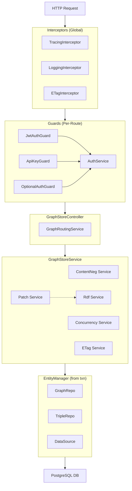

# Component Dependency Matrix

#normative #inception #reference

## SPARQL 1.2 Graph Store Protocol Server

| Field | Value |
|-------|-------|
| **Document type** | AIDLC Application Design — Component Dependencies |
| **Status** | Amended |
| **Technology Stack** | NestJS + TypeScript + PostgreSQL |

> **Amendment log.** Three updates: (D-05) `ConcurrencyService` now depends on `TypeORM DataSource` (for `EntityManager`) rather than a raw `pg.Pool`; (S-01) `PatchService` depends on `RdfService` as a thin wrapper; `RdfService` external dependency updated from "N3.js only" to multi-library.

---

## 1. Dependency Overview

### 1.1 Dependency Diagram



---

## 2. Dependency Matrix

### 2.1 Service Dependencies

| Consumer | Provider | Type | Description |
|----------|----------|------|-------------|
| **GraphStoreController** | GraphStoreService | DI | Main business logic |
| **GraphStoreController** | GraphRoutingService | DI | URI parsing |
| **GraphStoreController** | ContentNegotiationService | DI | Format negotiation |
| **GraphStoreService** | GraphRepository | DI | Graph CRUD |
| **GraphStoreService** | TripleRepository | DI | Triple CRUD |
| **GraphStoreService** | ConcurrencyService | DI | Advisory locks |
| **GraphStoreService** | ETagService | DI | ETag generation |
| **GraphStoreService** | RdfService | DI | RDF parse/serialize |
| **GraphStoreService** | PatchService | DI | SPARQL Update (thin wrapper) |
| **GraphStoreService** | DataSource | DI | Transaction management |
| **ConcurrencyService** | DataSource | DI | `EntityManager` for transaction-scoped lock (Amendment D-05) |
| **PatchService** | RdfService | DI | Delegates all operations (Amendment S-01) |
| **RdfService** | rdfxml-streaming-parser | Module | RDF/XML parsing |
| **RdfService** | jsonld-streaming-parser / jsonld | Module | JSON-LD parsing / serialization |
| **RdfService** | N3.js | Module | Turtle/TriG/N-Triples/N-Quads |
| **RdfService** | sparqljs | Module | SPARQL Update parsing for `applyPatch` |
| **RdfService** | rdf-canonize | Module | RDFC-1.0 (test harness only, not write path) |
| **CapabilityController** | CapabilityService | DI | OPTIONS response |
| **JwtAuthGuard** | AuthService | DI | JWT validation |
| **ApiKeyGuard** | AuthService | DI | API Key validation |
| **TracingInterceptor** | OpenTelemetry | SDK | Span creation |
| **LoggingInterceptor** | Pino Logger | Module | Structured logging |

---

### 2.2 Repository Dependencies

| Consumer | Provider | Type | Description |
|----------|----------|------|-------------|
| **GraphStoreService** | GraphRepository | DI | Graph operations |
| **GraphStoreService** | TripleRepository | DI | Triple operations |
| **GraphRepository** | TypeORM / PostgreSQL | ORM | SQL queries |
| **TripleRepository** | TypeORM / PostgreSQL | ORM | SQL queries |

---

### 2.3 External Dependencies

| Component              | External                         | Type      | Description                                                    |
| ---------------------- | -------------------------------- | --------- | -------------------------------------------------------------- |
| **ConcurrencyService** | TypeORM DataSource               | Framework | `EntityManager` for `pg_advisory_xact_lock()` (Amendment D-05) |
| **GraphRepository**    | PostgreSQL                       | Database  | Graph table                                                    |
| **TripleRepository**   | PostgreSQL                       | Database  | Triples table (with `idx_triples_unique` dedup index)          |
| **RdfService**         | N3.js                            | npm       | Turtle/TriG/N-Triples/N-Quads                                  |
| **RdfService**         | rdfxml-streaming-parser          | npm       | RDF/XML parse                                                  |
| **RdfService**         | in-house `RdfXmlSerializer`      | local     | RDF/XML serialize (Branch B chosen in GSP-005)                 |
| **RdfService**         | jsonld + jsonld-streaming-parser | npm       | JSON-LD parse/serialize                                        |
| **RdfService**         | sparqljs                         | npm       | SPARQL Update parse/AST                                        |
| **RdfService**         | rdf-canonize                     | npm       | RDFC-1.0 (test harness only)                                   |
| **JwtAuthGuard**       | @nestjs/jwt                      | npm       | JWT verification                                               |
| **TracingInterceptor** | OpenTelemetry                    | SDK       | Distributed tracing                                            |
| **LoggingInterceptor** | Pino                             | npm       | JSON logging                                                   |

---

## 3. NestJS Module Structure

### 3.1 Module Dependency Tree

```
AppModule
├── DatabaseModule (TypeORM)
│   └── PostgreSQL Connection Pool + DataSource
├── RdfModule
│   └── RdfService (multi-library: N3.js + rdfxml-streaming-parser + jsonld + sparqljs)
├── AuthModule
│   ├── AuthService
│   ├── JwtAuthGuard
│   ├── ApiKeyGuard
│   ├── OptionalAuthGuard
│   └── JwtStrategy
└── GraphStoreModule
    ├── GraphStoreController
    ├── CapabilityController
    ├── GraphStoreService
    ├── GraphRoutingService
    ├── ContentNegotiationService
    ├── ConcurrencyService          ← uses DataSource, not raw pg.Pool
    ├── ETagService
    ├── PatchService                ← thin wrapper over RdfService; MUST be implemented
    ├── CapabilityService
    ├── GraphRepository
    └── TripleRepository
```

---

## 4. Communication Patterns

### 4.1 Synchronous (DI)

| Pattern | Components |
|---------|------------|
| **Dependency Injection** | All services, repositories, guards |

### 4.2 Database Operations

| Pattern | Components |
|---------|------------|
| **TypeORM DataSource.transaction()** | GraphStoreService — all mutations |
| **EntityManager (inside transaction)** | ConcurrencyService.lock(), GraphRepository.*InTxn(), TripleRepository.*InTxn() |

> **Amendment D-05 note:** `ConcurrencyService` no longer holds a direct reference to `pg.Pool`. It calls `manager.query(...)` where `manager` is the `EntityManager` passed from the open transaction. This ensures advisory lock and writes share one DB connection.

---

## 5. Dependency Injection (DI) Map

### 5.1 Providers by Module

**GraphStoreModule:**

```typescript
providers: [
  GraphStoreService,
  GraphRoutingService,
  ContentNegotiationService,
  ConcurrencyService,
  ETagService,
  PatchService,       // thin wrapper; delegates to RdfService — must be implemented
  CapabilityService,
  GraphRepository,
  TripleRepository,
]

exports: [
  GraphStoreService,
  CapabilityService,
]
```

**RdfModule:**

```typescript
providers: [RdfService]
exports:   [RdfService]
```

**AuthModule:**

```typescript
providers: [
  AuthService,
  JwtAuthGuard,
  ApiKeyGuard,
  OptionalAuthGuard,
  JwtStrategy,
  ...configProviders,
]

exports: [
  AuthService,
  JwtAuthGuard,
  ApiKeyGuard,
  OptionalAuthGuard,
]
```

---

## 6. Circular Dependency Prevention

### 6.1 Allowed Patterns

|Pattern|Example|
|---|---|
|Service → Repository|GraphStoreService → GraphRepository|
|Service → Service (shared interface)|ConcurrencyService → ETagService|

### 6.2 Disallowed Patterns

|Pattern|Prevention|
|---|---|
|Repository → Service|Use events or separate module|
|Guard → Controller|Guards receive service via constructor|
|Controller → Guard|Guard handles auth, not controller|

---

## 7. Configuration Dependencies

### 7.1 Environment Variables by Component

| Component              | Variables                                                      |
| ---------------------- | -------------------------------------------------------------- |
| **DatabaseModule**     | `GSP_DATABASE_URL`                                             |
| **AuthService**        | `GSP_AUTH_JWT_SECRET`, `GSP_AUTH_API_KEYS`                     |
| **RdfService**         | —                                                                |
| **GraphStoreService**  | `GSP_BASE_URL` (for minted graph IRIs)                         |
| **TracingInterceptor** | `GSP_OTEL_ENABLED`, `GSP_OTEL_ENDPOINT`                        |
| **LoggingInterceptor** | `NODE_ENV`, `LOG_LEVEL`                                        |
| **CapabilityService**  | `GSP_PATCH_ENABLED`                                            |
| **NestJS body parser** | `GSP_MAX_PAYLOAD_SIZE` (default 100MB)                         |
| **TripleRepository**   | `GSP_STREAM_THRESHOLD` (default 10MB, for cursor batch sizing) |

---

## 8. Test Dependencies

### 8.1 Unit Test Mocking

| Component          | Mock                                                 |
| ------------------ | ---------------------------------------------------- |
| GraphRepository    | `jest.fn()` with mock data                           |
| TripleRepository   | `jest.fn()` with mock triples                        |
| RdfService         | `jest.fn()` with mock DatasetCore                    |
| ConcurrencyService | `jest.fn()` for lock behavior (mock `manager.query`) |
| DataSource         | `{ transaction: jest.fn(fn => fn(mockManager)) }`    |

### 8.2 Integration Test Dependencies

| Component | Requirement |
|-----------|-------------|
| PostgreSQL | Test container or local instance (real DB required for G9 concurrency tests) |
| Auth | Test JWT secret, test API keys |
| OTel | Optional (can be disabled via `GSP_OTEL_ENABLED=false`) |

---

## 9. Deployment Dependencies

### 9.1 Required Services

|Service|Required|Description|
|---|---|---|
|PostgreSQL|Yes|Primary data store|
|OTel Collector|No|Trace/log forwarding (optional)|
|Redis|No|Session storage (future)|

### 9.2 Resource Requirements

|Component|Memory|CPU|
|---|---|---|
|NestJS App|256MB-1GB|0.5-2 cores|
|PostgreSQL|512MB-4GB|1-4 cores|
|OTel Collector|128MB|0.25 cores|

---

*Component dependency matrix amended per pre-construction review. See `GSP-ApplicationDesign-Review.md`.*
